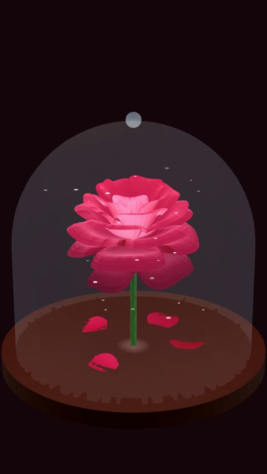

# Enchanted Rose — art from pure mathematics

There is no 3D model here. No mesh file, no textures, no sculpting. The rose is a **parametric surface**: two numbers go in, a point in space comes out, and sweeping them across their ranges traces the entire bloom. Change a coefficient and the flower changes shape.

<p align="center">
  
</p>

The rendered animation is committed as [`rose.mp4`](rose.mp4) — 1080x1920, 30 fps, 8 seconds.

## The rose is an equation

The bloom is Paul Nylander's parametric rose. Two parameters sweep it out: `u` runs across a petal from base to edge, and `v` spirals outward through the whole flower.

$$\varphi(v) = \frac{\pi}{2}\,e^{-v/8\pi} \qquad\text{— petals lie flatter the further out they go}$$

$$X(v) = 1 - \tfrac{1}{2}\left(\tfrac{5}{4}\left(1 - \tfrac{v \bmod 2\pi}{\pi}\right)^{2} - \tfrac{1}{4}\right)^{2}$$

That `mod` term is the interesting one. It folds `v` back on itself once per turn, and squaring the result puts a smooth ripple into the radius — which is exactly what gives every petal its ruffled edge. The waviness is not modelled or drawn; it falls out of the arithmetic.

$$y = 1.9565\,u^{2}(1.2765u - 1)^{2}\sin\varphi, \qquad R = X\,(u\sin\varphi + y\cos\varphi)$$

$$(x, y, z) = \bigl(R\cos v,\; R\sin v,\; X(u\cos\varphi - y\sin\varphi)\bigr)$$

Raising the `v` range adds more turns of the spiral, and therefore more layers of petals.

## Parametric, not ray marched

This is the odd one out. Its sibling projects — [jellyfish](https://github.com/el-bakkali/manim-glsl-jellyfish) and [butterflies](https://github.com/el-bakkali/manim-glsl-butterflies) — are *signed distance fields* ray marched in a GLSL shader: a function answers "how far to the nearest surface?" and rays walk in until the answer is zero.

Nylander's rose cannot work that way. It is a **generative** formula — it produces surface points directly, and has no cheap way to answer how far away it is from an arbitrary point in space. So instead of marching rays at it, the surface is evaluated on a grid and drawn as geometry, which is precisely what Manim's `Surface` is for. It also gives the visible mesh, since each quad of the parameter grid is a real polygon.

## The cloche

The glass dome, base, stem and fallen petals are all parametric surfaces too, sharing one camera with the rose so the glass sorts correctly in front of the bloom:

```python
def cloche(u, v):          # u sweeps around, v runs up the profile
    if v < 0.58:
        radius, height = DOME_R, (v / 0.58) * DOME_H
    else:                  # then bend over into the cap
        t = (v - 0.58) / 0.42 * (PI / 2)
        radius, height = DOME_R * np.cos(t), DOME_H + DOME_R * np.sin(t)
    return np.array([radius * np.cos(u), radius * np.sin(u), BASE_Z + height])
```

Glass is just a very low `fill_opacity` with no stroke. Drawing the mesh lines on it made it read as a wire cage rather than a window.

## Running it

Requires [`uv`](https://docs.astral.sh/uv/) and `ffmpeg`.

```powershell
uv sync
.\render.ps1
```

Roughly 10 minutes for 8 seconds at 1080x1920 on a laptop CPU. Faster drafts:

```powershell
.\render.ps1 -Duration 4 -RoseU 12 -RoseV 150
```

A single still is the sane way to iterate:

```powershell
uv run manim -s -r 1080,1920 enchanted.py EnchantedRose
uv run manim -s -r 1080,1920 nylander.py NylanderRose   # the bare rose, no cloche
```

`ROSE_U` and `ROSE_V` set the parameter grid. `ROSE_V` matters most: it controls how finely the spiral is sampled, and too low turns petal edges into visible facets.

## Things worth knowing if you fork this

| Where | Controls |
| --- | --- |
| `TURNS` | how many layers of petals the spiral lays down |
| `RAMP` | colour by height, deep crimson through to pink |
| `ROSE_SCALE` / `ROSE_Z` | fit of the bloom inside the dome |
| `stroke_width` on the rose | how strongly the mesh grid reads |
| `cloche` | dome profile |

Four Manim behaviours cost real time here, all specific to the Cairo renderer:

- **The OpenGL renderer is unusable for this.** It is far faster, but has no depth sorting, so the rose renders see-through with its far petals showing through the near ones, and it ignores `set_fill_by_value` entirely. Cairo is slow but correct.
- **`Cylinder` throws** `AttributeError: 'Cylinder' object has no attribute 'fill_color'` under Cairo. Plain parametric tube and disc surfaces work fine.
- **`Dot3D` cannot be added to `VGroup` *or* `Group`** — it resolves to a type Cairo rejects. Ordinary `Dot`s placed at 3D points work, and they always face the camera, which is what a sparkle wants anyway.
- **An `ImageMobject` backdrop composites *over* the 3D content**, not behind it, even when added first. A flat `background_color` is the reliable option.
- Two surfaces at nearly the same height **z-fight** and interleave into a spoked pattern, because Cairo sorts whole polygons by depth. Tint one surface rather than layering a second just above it.

## Licence

MIT — see [LICENSE](LICENSE).
